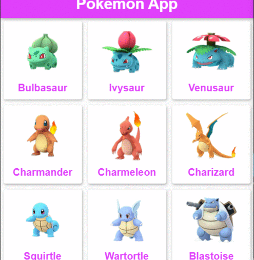
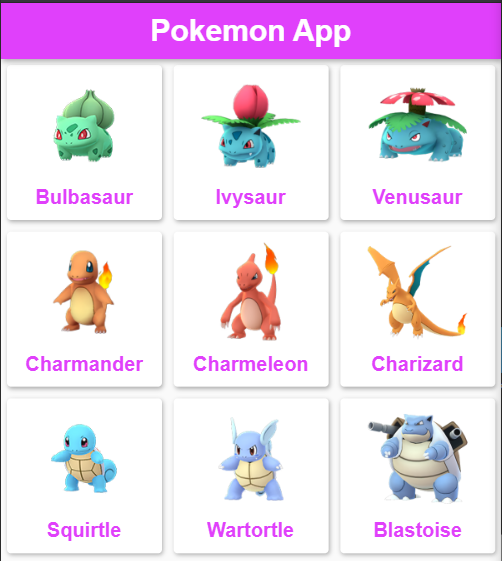
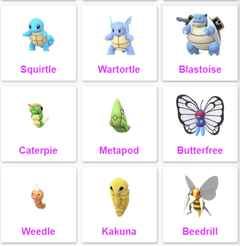
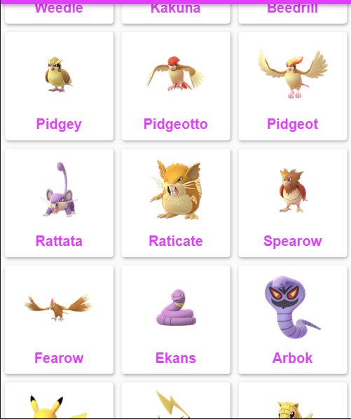
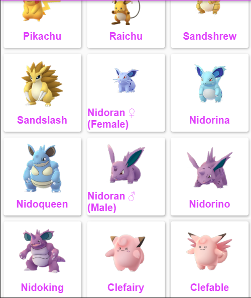
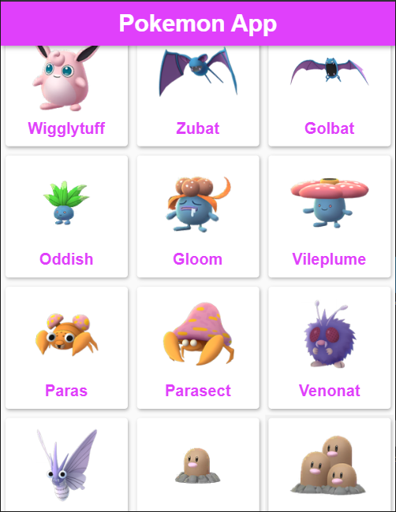
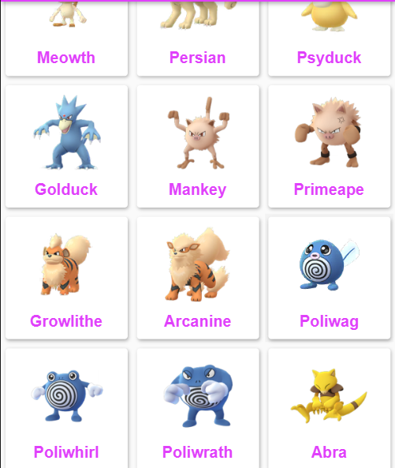
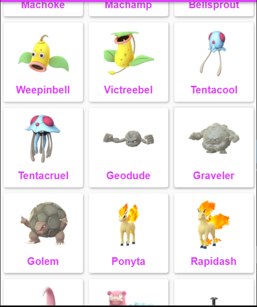
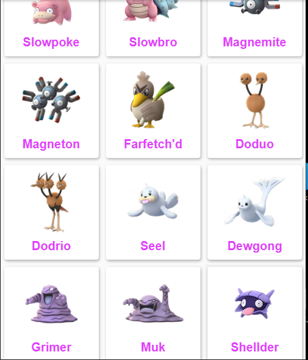
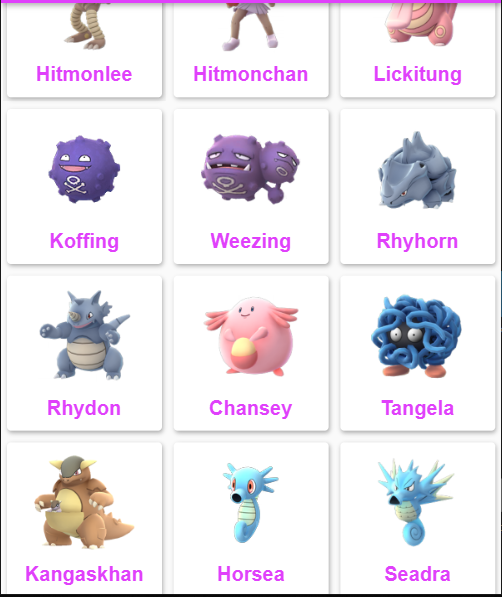

# GitHub Actions Flutter :boom:

This is the repo which can be used to get the GitHub Actions using the Flutter. The Project is working on this link https://irahulcse.github.io/GitHub-Actions-Hackathon/#/

## GitHub Actions File:
This example first fetches the dependencies with `flutter pub get` and then builds an web application deployed using GitHub Pages on the Web.

```
flutter_web.yaml
name: Flutter Web Buid Project

on:
  push:
    branches:
      - master

jobs:
  build:
    runs-on: ubuntu-latest

    steps:
      - name: Checkout
        uses: actions/checkout@v2

      - name: Setup Flutter
        uses: subosito/flutter-action@v1
        with:
          channel: "beta"

      - name: Enable Flutter Web
        run: flutter config --enable-web

      - name: Install dependencies
        run: flutter packages get

      - name: Build Web
        run: flutter build web

      - name: Build Actions
        uses: peaceiris/actions-gh-pages@v3
        with:
          github_token: ${{secrets.token}}
          publish_dir: ./build/web

```


## Unique Features of the Application:
* [✅]Widgets created for the UI are like as Card, Hero, Animation, Positioned.
* [✅] Parsed the data using **JSON Decode** which helped to bring the data from the API in the form of List.
* [✅]Map is an data structure which is used for passing it through the function.
* [✅] Live Working Project
* [✅] Widgets used like ListTile, ListView Builder, Center, Text and Circle Avatar Widgets
<!-- * [❌] Everything is static right now, no API integration done on it. -->
  
### Screenshots and Working Images:

        


 Sorry for the quality of the PNG :pray:


### Show some love :heart: and star the repo to support the project

If you had like the project pls hit the star :+1: icon.

The Parent Repository of this project can be found on this [link](https://github.com/irahulcse/A-Complete-Guide-To-Flutter).

# Live Working Project:

[Demo Application](https://irahulcse.github.io/Flutter_Pokemon_App/#/)

### Created with :heart:
A a Pre-Final Year Computer Science Student, an experienced Software Developer with a demonstrated history of working in the information technology and services industry. Seasoned Competitive Coder. Skilled in C++, Python, Data Analysis, Java, Dart and Julia. Strong information technology professional with a Bachelor of Engineering - BE focused in Computer Science from Chandigarh University. 

I am currently looking for Full Time/ Internship Offer for any Software Development Roles. Pls, checkout my [Resume](https://drive.google.com/file/d/1BYZcHo9SGrI5h10fxFbtqPLz86ni_VnR/view?usp=sharing).  I am very passionated about Software Development :heart:

<a href="https://twitter.com/1rahulchandra1"></a>
<a href="https://www.linkedin.com/in/rahul-chandra-a8371b11b/"></a>
<a href="https://facebook.com"></a>
<a href="https://instagram.com/rahulchandra_99"></a>

## Getting Started

For help getting started with Flutter, view our online
[documentation](https://flutter.dev/).


## Contribution:
Please clone and star this repo to stay up to date on changes. If anyone, would like to contribute to it. You can open the issue and start contributing to it.

